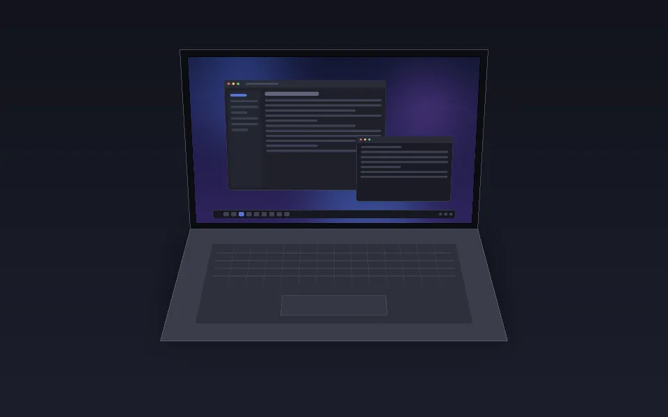

# Hinge Glass

[简体中文](README.zh_CN.md)

[](https://github.com/RichardLitt/standard-readme)
[](https://github.com/iwinoid/kwin-hinge-glass/actions/workflows/ci.yml)
[](https://spdx.org/licenses/GPL-3.0-or-later.html)
[](https://deepseek.com)
[](https://github.com/deepseek-ai/deepseek-harness)
[](https://www.linux.org/)
[](https://kde.org/plasma-desktop)

A KWin effect that folds the desktop into frosted glass while the laptop lid moves.

Hinge Glass reads the hinge angle sensor of a convertible laptop. It renders the screen as a pane of glass that turns away from a content plane fixed in space. The plane stays still. The glass moves over it. The distance between them sets the frost. The effect answers the folding animation of the iPhone Duo, adapted to the bottom hinge of a laptop.

The effect renders the scene into its own framebuffer and draws it back with a custom shader. It uses the live scene. Thus it needs no screen-recording permission, and it follows the hinge in real time.

## Screenshots



The lid closes from 100° and opens again. The recording loops.


## Table of Contents

- [Screenshots](#screenshots)
- [Background](#background)
- [Install](#install)
  - [Dependencies](#dependencies)
  - [Check your machine](#check-your-machine)
  - [Other sensors](#other-sensors)
  - [From Source](#from-source)
  - [Uninstall](#uninstall)
- [Usage](#usage)
- [Configuration](#configuration)
  - [Hinge Position](#hinge-position)
- [Troubleshooting](#troubleshooting)
- [Architecture](#architecture)
- [Maintainers](#maintainers)
- [Thanks](#thanks)
- [Contributing](#contributing)
- [Changelog](#changelog)
- [License](#license)

## Background

Convertible laptops fold through 360 degrees. The hinge angle sensor reports that motion. Most software ignores it.

The iPhone Duo shows a different idea. When the inner screen unfolds, one half is already flat and shows normal content. The other half is still tilted, and an animation makes it look like a screen that stays in the horizontal plane.

Hinge Glass applies that idea to a laptop. The whole panel plays the part of the tilted half. The desktop acts as a plane fixed in space. When the lid moves, the content appears to stay in place while the glass turns over it.

The shader comes from a macOS prototype. See [Thanks](#thanks).

## Install

### Dependencies

- KDE Plasma 6 with KWin on Wayland
- An OpenGL compositing backend
- A hinge angle sensor. The effect reads the `cros-ec-lid-angle` IIO device. The ChromeOS EC driver supplies it.

Build dependencies:

```
base-devel cmake ninja extra-cmake-modules
qt6-base qt6-tools kwin kconfig kcoreaddons ki18n kwidgetsaddons kcmutils
vulkan-headers
```

KWin needs `vulkan-headers` at build time. Install it, and `find_package(KWin)` succeeds.

### Check your machine

Run this command:

```bash
./hinge_poll.sh --once
```

If it prints an angle, the machine has the sensor and this effect can work.

Chromebooks have the sensor. The driver comes from the ChromeOS EC, thus other laptops with a Chrome EC can have it too. The check takes one second, so try it.

### Other sensors

The effect reads one IIO device, `cros-ec-lid-angle`. The effect needs that device.

The sensor layer is a single file, `src/hingesensor.cpp`. The function `findDevicePath()` selects the device. The reader takes `in_angl_raw` as a whole number of degrees, from 0 to 360.

To attach another sensor, change `findDevicePath()`, or replace the reader in that file. Keep two rules:

- Give the angle in degrees, from 0 to 360.
- The effect treats a value of 400 or more as "no data", and then holds the last good angle. Report that value for an unreliable reading.

### From Source

```bash
git clone https://github.com/iwinoid/kwin-hinge-glass.git
cd hinge-glass
./rebuild.sh
```

`rebuild.sh` makes a clean build, runs the tests, and installs two files into the Qt plugin directory. It needs `sudo` for the install step.

`./rebuild.sh --build` only builds. `./rebuild.sh --uninstall` removes the effect.

To load the effect the first time, open **System Settings → Desktop Effects** and enable **Hinge Glass** in the *Appearance* group. KWin loads it immediately. No restart is necessary.

If you built the effect before and install a new version, log out and log in again. KWin keeps a loaded plugin in memory. See [Troubleshooting](#troubleshooting).

### Uninstall

```bash
./rebuild.sh --uninstall
```

## Usage

1. Set the **Original Angle** to the angle you use every day. Open the lid to that position and read the value from `./hinge_poll.sh --once`. The default is 100 degrees.
2. Fold the lid below that angle. The glass effect appears and grows as the lid closes.
3. Stop moving the lid. After 300 ms the screen returns to normal.

`hinge_poll.sh` prints the live hinge angle and the mode. Use it to examine the sensor or to find a value for the Original Angle.

```bash
./hinge_poll.sh          # live, Ctrl+C to stop
./hinge_poll.sh --once   # one reading
```

## Configuration

Open **System Settings → Desktop Effects → Hinge Glass → ⚙**.

| Setting | Default | Purpose |
|---|---|---|
| Original Angle | 100° | At or above this angle the effect is off. Below it the effect starts and grows with the fold. |
| Fold Limit | 45° | The fold angle at full closure. The effect grows with the fraction of the way from the Original Angle down to closed, so it keeps changing over the whole travel. |
| Curve Exponent | 0.65 | Shape of the strength curve. At 1.0 the effect grows in a straight line and takes about 370 ms to become visible. At 0.65 it takes about 190 ms, and the middle of the fold is stronger. |
| Still Tolerance | 10° | Movement within this range lets the dwell timer continue. |
| Hinge Position | 0 | Distance from the effective rotation center to the bottom edge of the screen, divided by screen height. See below. |
| Hold After Stop | 300 ms | The effect stays this long after the lid stops moving. Type any value from 0 to 5000. |
| Hold Segments | `80:2000,100:300` | Hold time per angle band, as `angle:ms` pairs. Below 80° the effect holds 2000 ms after the lid stops. From 80° to 100° it holds 300 ms. Leave empty to use Hold After Stop over the whole range. |
| Keep Until Return | off | Keep the effect while the lid stays folded. It ends when the lid returns to the Original Angle. This suits a demonstration. |
| Restore Time | 180 ms | Fade-out time. It applies when Keep Until Return is off. |
| Minimum Display | 350 ms | The shortest time the effect stays on screen. It prevents a short flash. |
| Frost | 0.09 | Frost strength. The useful range is small, 0 to 0.18. |
| Eye Distance | 2.4 | Perspective strength. A larger value flattens the effect. |
| Frost Samples | 24 | The sample count for the frost. A lower value costs less and blurs less. |
| Idle Rate | 20 Hz | Sensor rate while the lid stays still. Raise it for a faster first response, lower it to save power. |
| Active Rate | 30 Hz | Sensor rate while the lid moves. |
| Smoothing Spring | 30 rad/s | Smooths the sensor reading to the screen refresh rate. This sets the response speed. A low value makes the effect arrive late. |
| Demo Mode | off | Hold a fixed fold angle. The effect ignores the sensor. Use it to show or tune the effect while the lid stays still. |

The effect returns when you fold deeper than at the last fade. A small move in place changes nothing, and a fold in the other direction changes nothing. See [Hinge Position](#hinge-position) and the notes above.

Each setting lives in the `[Effect-hinge_glass]` group of `kwinrc`.

### Hinge Position

The shader turns the screen around a line. The setting says where that line is.

**Ideal single hinge.** The rotation center is exactly on the bottom edge of the screen. The bottom edge sits on the center. Only the top edge travels. This is the default, and it is the behavior of the reference implementation.

**Real single hinge.** The rotation center sits below the bottom edge of the screen, because the hinge mechanism needs space. The bottom edge then moves a little as well. The bottom edge and the top edge travel on two circles around the same center. Set a negative value for this case. Divide the offset by the screen height. For a screen 200 mm high with the center 16 mm below the edge, use -0.08.

**Center inside the screen.** A positive value puts the center above the bottom edge. The part below the center then stays normal.

The physical size of the panel is often unavailable. Measure the screen height and the offset yourself, then divide.

## Troubleshooting

### The effect stops working after a KWin update

CI builds the effect against the KWin version in the Arch repositories every day. A green run means the code still compiles against today's KWin. A red run means the source needs a change before the next rebuild.

Each green run that finds a new KWin version publishes a release named `kwin-<version>`. The archive holds both plugins and a short install note. The archive only works on that exact KWin version.

The plugin factory ID contains the KWin version, for example `org.kde.kwin.EffectPluginFactory6.7.5`. A patch release of KWin changes that ID. KWin then rejects the plugin and writes one debug line only. Run `./rebuild.sh` after each KWin update.

Plasma publishes its bugfix releases on a fixed schedule. The gaps between them are 1, 1, 2, 3, 5 and 8 weeks. A feature release arrives every four months and starts the cycle again. Expect about five rebuilds in the three months after a feature release, then a quieter stretch. See the [Plasma 6 schedule](https://community.kde.org/Schedules/Plasma_6).

### A new build still runs the old code

KWin keeps a loaded plugin in memory. A disable and enable cycle makes a new instance that runs the old code. Log out and log in again.

To confirm, examine the mapped file:

```bash
sudo grep hinge_glass /proc/$(pgrep -x kwin_wayland)/maps
```

The tag `(deleted)` shows that KWin uses a replaced file.

### The effect stays off

Check that the sensor exists:

```bash
./hinge_poll.sh --once
```

A failure means the machine lacks the `cros-ec-lid-angle` sensor, and KWin skips the effect. The Desktop Effects page shows plugin effects as available in all cases, thus a missing sensor looks like a broken effect. See [Check your machine](#check-your-machine).

## Architecture

| Part | File | Task |
|---|---|---|
| Effect entry | `src/main.cpp` | Declares the plugin factory. |
| Effect | `src/hinge_glass.cpp` | Connects to KWin. Renders the scene into a framebuffer. Draws the glass. |
| Shader | `src/glassshader.h` | The glass fragment shader. |
| State machine | `src/hingestate.cpp` | Maps the hinge angle to the fold angle. It is plain C++, thus the tests need no display. |
| Sensors | `src/hingesensor.cpp`, `src/lidsensor.cpp` | Read the angle from sysfs. Read the lid switch from KWin input events. |
| Settings panel | `src/kcm/` | The KCM page. |
| Offline preview | `tools/preview/` | Renders the shader to a PNG file on its own. Use it to examine a shader change. |
| Demo builder | `tools/demo/` | Builds the animated demo in this README. Run `./tools/demo/build.sh`. |

Run the tests with `ctest` in the build directory.

## Maintainers

- [Iwinoid](https://github.com/iwinoid)

## Thanks

- **MacBook Duo / Hinge Glass**: a macOS prototype. The glass shader in `src/glassshader.h` comes from it. The repository and the license file of the project are both unpublished. Its author permits modification of the code. See [NOTICE](NOTICE).
- [Atomicx7/Duo-animation](https://github.com/Atomicx7/Duo-animation). The projection model of the original folding animation.
- [sumimakito/Mac-Duo](https://github.com/sumimakito/Mac-Duo), Apache-2.0, Copyright 2026 Makito. The timing and smoothing mechanisms come from here.
- [KWin](https://invent.kde.org/plasma/kwin), GPL-2.0-or-later. The effect API, and the `screentransform` and `zoom` effects, which show the offscreen framebuffer pattern.
- [kwin-effects-better-blur-dx](https://github.com/xarblu/kwin-effects-better-blur-dx), GPL-3.0. A third-party KWin 6 effect, used as a build-system reference.

## Contributing

Questions and bug reports are welcome on the [GitHub Issues](https://github.com/iwinoid/kwin-hinge-glass/issues) page. Pull requests are accepted.

Open an issue before a large change. Examine a shader change with `tools/preview` first, because a wrong shader is hard to see in a live session.

## Changelog

- **1.0**: first release. It has the hinge angle sensor, the glass shader, the state machine, the settings panel, and the offline preview tool.

## License

[GPL-3.0-or-later](LICENSE) © Iwinoid

This project uses [KWin](https://invent.kde.org/plasma/kwin) (GPL-2.0-or-later) and [Qt 6](https://qt.io) (LGPL-3.0 / GPL-2.0). See [NOTICE](NOTICE) for the full attribution.
